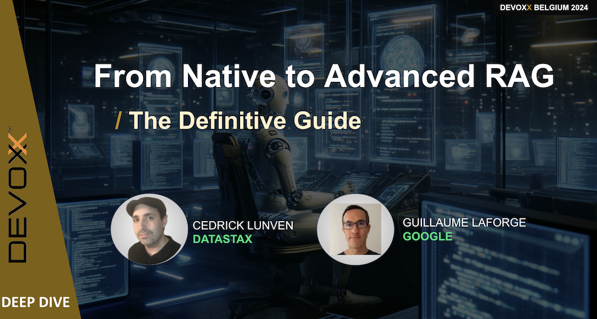

## 🧑🏻‍💻 🧑🏾‍💻 From naive to advanced RAG: The complete guide 👩🏿‍💻 👩‍💻

ℹ️ **About this Session**

> It’s easy to get started with Retrieval Augmented Generation, but you’ll quickly be disappointed with the generated answers: inaccurate or incomplete, missing context or outdated information, bad text chunking strategy, not the best documents returned by your vector database, and the list goes on.

> After meeting thousands of developers across Europe, we’ve explored those pain points, and will share with you how to overcome them. As part of the team building a vector database we are aware of the different flavors of searches (semantic, meta-data, full text, multimodal) and embedding model choices. We have been implementing RAG pipelines across different projects and frameworks and are contributing to LangChain4j.

> In this deep-dive, we will examine various techniques using LangChain4j to bring your RAG to the next level: with semantic chunking, query expansion & compression, metadata filtering, document reranking, data lifecycle processes, and how to best evaluate and present the results to your users.

⏲️ **Duration :** `3 hours`

🎓 **Level** `Intermediate`

## 📋 Table of Demos

